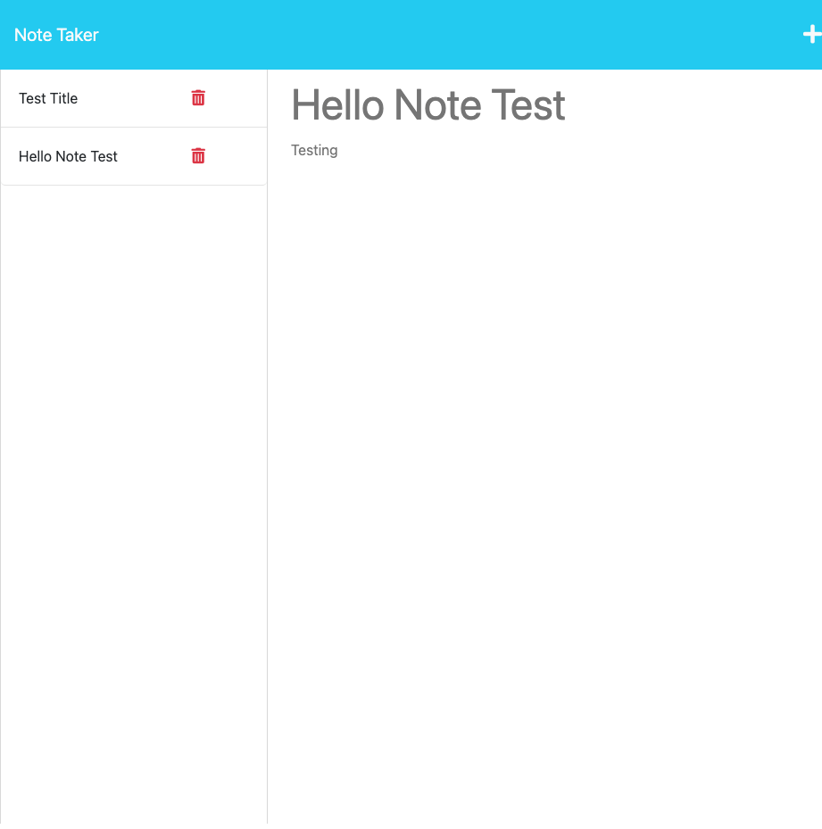

 
# Note-Taker Challenge

## **Description**

This project highlights the use of Express.js to build an application where a user can write and save notes! Starter code was provided for front-end functionality; students were tasked to build routes to connect front-end and back-end and submit a working application!

## Table of Contents
  * [Description](#description)
  * [Mock Up](#mockup)
  * [Usage](#usage)
  * [Technologies Used](#technologies-used)
  * [Live Application](#liveapplication)
  * [Questions](#questions)

## Mock-Up

The following images show the web application's appearance and functionality:

## Usage

User must follow this link.
* Click on "Get Started" to navigate away from the landing page
* Then the "Title" and "Text" fields for the "save button to appear"
* New notes will be saved, and you can also navigate through your saved notes to open and edit them.

## Technologies Used

JavaScript
Node.js
Express.js
BootStrap
Heroku
Github

### Live Application
[Heroku Reroute](https://mighty-refuge-42947.herokuapp.com/ )

## Questions

Follow my Github https://alexozy.github.io/team-profile-generator.

If you want to contact me you can reach me at alexanoz@outlook.com .

